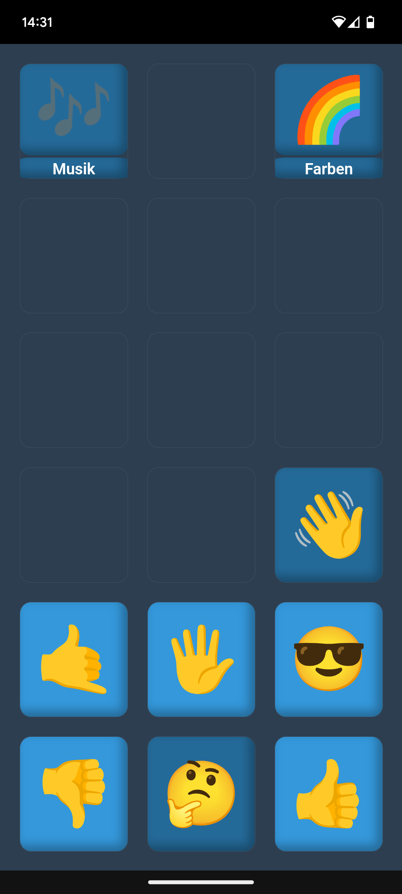

# TalkTree – UK Framework

   

TalkTree soll eine offene und zugängliche Plattform bieten, die Menschen mit Kommunikationsbarrieren dabei unterstützt, die eigene Stimme zu finden. Durch eine Vielzahl von Anpassungsmöglichkeiten lässt sich die App ganz individuell auf den Bedarf der Nutzer:innen abstimmen.

Ein weiterer wichtiger Aspekt bei der Entwicklung war, die [Bearbeitung](https://github.com/c-smo/TalkTree-Edit/blob/main/TalkTree_Edit/Anleitungen/Erste_Schritte.md) so einfach wie möglich zu gestalten, um sowohl Angehörigen als auch Betreuer:innen zu ermöglichen, ohne große Hindernisse auf die Bedürfnisse der Nutzer:innen eingehen zu können.

Dieses Programm ist unter der [MIT](https://github.com/c-smo/TalkTree-App/blob/main/LICENSE.md) Lizenz veröffentlicht und daher kostenfrei erhältlich. Mein Ziel ist es jedem Menschen die Möglichkeit zu schaffen, ein ganz persönliches Bäumchen zu pflanzen 🌱

Diese Version ist für **Endgeräte** gedacht. Informationen zur Bearbeitungssoftware **"TalkTree Editor"** findest du [hier](https://github.com/c-smo/TalkTree-Edit).

---

## Neuigkeiten:

### 02.02 - iOS Integration
Ich habe mich über die Möglichkeiten einer iOS-Integration informiert. Obwohl die EU 2024 ein Gesetz beschlossen hat, das Apple dazu motivieren soll, Geräte endlich für Drittanbieter zu öffnen, ist dies bis dato immer noch nur bedingt möglich. Außerhalb der EU ist es schlicht unmöglich.

Ich bin zwar wirklich froh, dass dieser Konzern so sehr auf unsere Sicherheit bedacht ist, aber ich habe die Vermutung, dass es auch alternative Lösungen gibt, anstatt eine jährliche Gebühr zu verlangen, um eine App als sicher qualifizieren zu können...

Ich gebe noch nicht auf, aber aktuell sieht es nicht gut aus :(

Um diese Neuigkeit aber auf einer positiven Note abzuschließen: Bevor es gar keine Alternative für iPads gibt (eigentlich ist iOS nur wegen iPads interessant, weil diese bereits in den meisten Einrichtungen verfügbar sind), werde ich das Geld lieber investieren um eine Website zu hosten, auf die man mit dem iPad zugreifen kann, um das Programm von dort zu starten. Ich habe auch noch 1-2 Ideen wie ich Apple vielleicht doch überreden kann. Des wird scho ois! :)

### 01.02 Nächste Schritte
Die Version v0.3.0 scheint derzeit stabil zu sein, d.h. mir sind keine Fehler bekannt. Sollte jemandem etwas auffallen, lasst es mich bitte wissen, damit ich es beheben kann.

Ich werde jetzt mit der iOS-Implementierung starten. Drückt mir die Daumen – Apple und ich sind im Moment nicht die besten Freunde.

### 31.01 - Neue Kontakt E-Mail
Ich dachte, die “c-smo@users.noreply.github.com”-Adresse leitet Nachrichten direkt an mich weiter, aber da habe ich mich getäuscht. Tut mir leid, falls jemand vergeblich auf eine Antwort gewartet hat. Ich habe die E-Mail Adresse jetzt ausgetauscht.

---

## Download:

**Wichtig:** Bitte stelle sicher, dass sowohl die **App**  als auch der [Editor](https://github.com/c-smo/TalkTree-Edit) auf einer kompatiblen Version sind. Hier zählt die erste Zahl in der Versions-Nummer, die keine 0 ist.

**Aktuelle Version: v0.3.0 - stable** 

Solltest du bereits eine ältere Version installiert haben, lösche diese bitte vorher, um mögliche Fehler zu vermeiden.  

---

- [TalkTree App | Android](https://github.com/c-smo/TalkTree-App/releases/download/v0.3.0/TalkTree-App_v0.3.0_android.apk)

- ~~[TalkTree App | iOS](URL)~~ _to-do_

---

## Anleitungen:
- [Installation | Android](https://github.com/c-smo/TalkTree-App/blob/main/TalkTree_App/Anleitungen/android.md)
- ~~[Installation | iOS](URL)~~ _to-do_

---

- [Updates](https://github.com/c-smo/TalkTree-App/blob/main/TalkTree_App/Anleitungen/updates.md)

---

## Kontakt

- Christopher Smolic
- c-smolic@proton.me