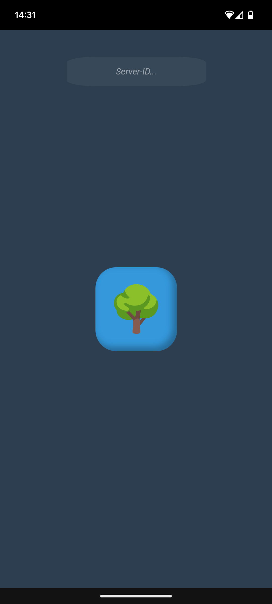

# Updates

## 1. Server aktivieren
Um Updates zu ermöglichen, muss der [Server](https://github.com/c-smo/TalkTree-Edit/blob/main/TalkTree_Edit/Anleitungen/Einstellungen/Server.md) aktiviert sein.

## 2. Netzwerk
Stelle sicher, dass sich beide Geräte im selben Netzwerk befinden.

## 3. Initialisierung
Starte die App auf dem gewählten Endgerät. Am oberen Bildschirmrand findest du ein Kästchen mit dem Text **"Server-ID"**. Wähle dieses Kästchen aus und füge deine [Server-ID](https://github.com/c-smo/TalkTree-Edit/blob/main/TalkTree_Edit/Anleitungen/Einstellungen/Server.md) ein.

   

## 4. Update
Nachdem du den 🌳-Knopf drückst, startet die App mit dem Update. Dies kann einige Augenblicke dauern.

## Schlusswort
Sobald ein Update einmal durchgeführt wurde, kann man die aktuelle Version öffnen, indem man auf den 🌳-Knopf drückt. Um eine neue Version aufzuspielen, wiederhole einfach den Update-Prozess.